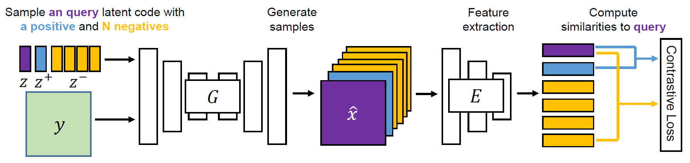

# DivCo: Diverse Conditional Image Synthesis via Contrastive Generative Adversarial Network

Pytorch implementation for our DivCo. We propose a simple yet effective regularization term named latent-augmented contrastive loss that can be applied to **arbitrary** conditional generative adversarial networks in different tasks to alleviate the mode collapse issue and improve the **diversity**.

Contact: Rui Liu (ruiliu@link.cuhk.edu.hk)

## Paper
DivCo: Diverse Conditional Image Synthesis via Contrastive Generative Adversarial Network<br>
[Rui Liu](https://ruiliu-ai.github.io/), [Yixiao Ge](https://geyixiao.com/), [Ching Lam Choi](https://github.com/chinglamchoi), [Xiaogang Wang](https://www.ee.cuhk.edu.hk/~xgwang/), and [Hongsheng Li](https://www.ee.cuhk.edu.hk/~hsli/)<br>
IEEE Conference on Computer Vision and Pattern Recognition (CVPR), 2021 <br>
[[arxiv]](https://arxiv.org/abs/2103.07893)
## Citing DivCo
If you find DivCo useful in your research, please consider citing:
```
@inproceedings{Liu_DivCo,
  author = {Liu, Rui and Ge, Yixiao and Choi, Ching Lam and Wang, Xiaogang and Li, Hongsheng},
  booktitle = {IEEE Conference on Computer Vision and Pattern Recognition},
  title = {DivCo: Diverse Conditional Image Synthesis via Contrastive Generative Adversarial Network},
  year = {2021}
}
```
## Framework


## Usage

### Prerequisites
- Python >= 3.6
- Pytorch >= 0.4.0 and corresponding torchvision (https://pytorch.org/)

### Install
- Clone this repo:
```
git clone https://github.com/ruiliu-ai/DivCo.git
```
## Training Examples
Download datasets for each task into the dataset folder
```
mkdir datasets
```
### Label-conditoned Image Generation
- Dataset: [CIFAR-10](https://www.cs.toronto.edu/~kriz/cifar.html) 
- Baseline: DCGAN
```
cd DivCo/DivCo-DCGAN
python train.py --dataroot ./datasets/Cifar10
```
### Paried Image-to-image Translation
- Paired Data: facades and maps
- Baseline: BicycleGAN <br>

You can download the facades and maps datasets from the BicycleGAN [[Github Project]](https://github.com/junyanz/BicycleGAN). <br>
We employ the network architecture of the BicycleGAN and follow its training process.
```
cd DivCo/DivCo-BicycleGAN
python train.py --dataroot ./datasets/facades
```
### Unpaired Image-to-image Translation
- Unpaired Data: Yosemite (summer <-> winter) and Cat2Dog (cat <-> dog)
- Baseline: DRIT <br>

You can download the datasets from the DRIT [[Github Project]](https://github.com/HsinYingLee/DRIT). <br>
Specify `--concat 0` for Cat2Dog to handle large shape variation translation
```
cd DivCo/DivCo-DRIT
python train.py --dataroot ./datasets/cat2dog --concat 0 --lambda_contra 0.1
python train.py --dataroot ./datasets/yosemite --concat 1 --lambda_contra 1.0
```
## Pre-trained Models
- [DivCo-DCGAN](https://drive.google.com/file/d/1r2CMH_79KU1dergFGYut-GBBgjtfi9Ap/view?usp=sharing) 
- [DivCo-BicycleGAN for Facades and Maps](https://drive.google.com/file/d/1Hkl5eYMHbGhVGEtqcHr9GMWGHQNLGGn8/view?usp=sharing)
- [DivCo-DRIT for Yosemite and Cat2dog](https://drive.google.com/file/d/1r2HmTCjZwWdVcKmuUjVdcXUL78vOl0Wf/view?usp=sharing)

Download and save them into 
```
./models/
```

## Evaluation
For [BicycleGAN](https://github.com/junyanz/BicycleGAN), [DRIT](https://github.com/HsinYingLee/DRIT) and [MSGAN](https://github.com/HelenMao/MSGAN), please follow the instructions of corresponding github projects of the baseline frameworks for more evaluation details. <br>
### Testing Examples
**DivCo-DCGAN** <br>
```
python test.py --dataroot ./datasets/Cifar10 --resume ./models/DivCo-DCGAN/00199.pth
```
**DivCo-BicycleGAN** <br>
```
python test.py --dataroot ./datasets/facades --checkpoints_dir ./models/DivCo-BicycleGAN/facades --epoch 400
```
```
python test.py --dataroot ./datasets/maps --checkpoints_dir ./models/DivCo-BicycleGAN/maps --epoch 400
```
**DivCo-DRIT** <br>
```
python test.py --dataroot ./datasets/yosemite --resume ./models/DivCo-DRIT/yosemite/01199.pth --concat 1
```
```
python test.py --dataroot ./datasets/cat2dog --resume ./models/DivCo-DRIT/cat2dog/01199.pth --concat 0
```

## Reference
- DCGAN [[Paper]](https://arxiv.org/abs/1511.06434)
- BicycleGAN [[Github Project]](https://github.com/junyanz/BicycleGAN) 
- DRIT [[Github Project]](https://github.com/HsinYingLee/DRIT)
- MSGAN [[Github Project]](https://github.com/HelenMao/MSGAN)

## Quantitative Evaluation Metrics
- FID [[Github Project]](https://github.com/bioinf-jku/TTUR)
- LPIPS [[Github Project]](https://github.com/richzhang/PerceptualSimilarity)
- NDB and JSD [[Github Project]](https://github.com/eitanrich/gans-n-gmms)
